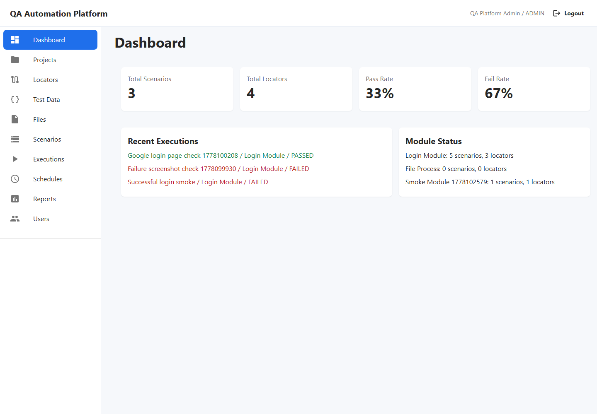
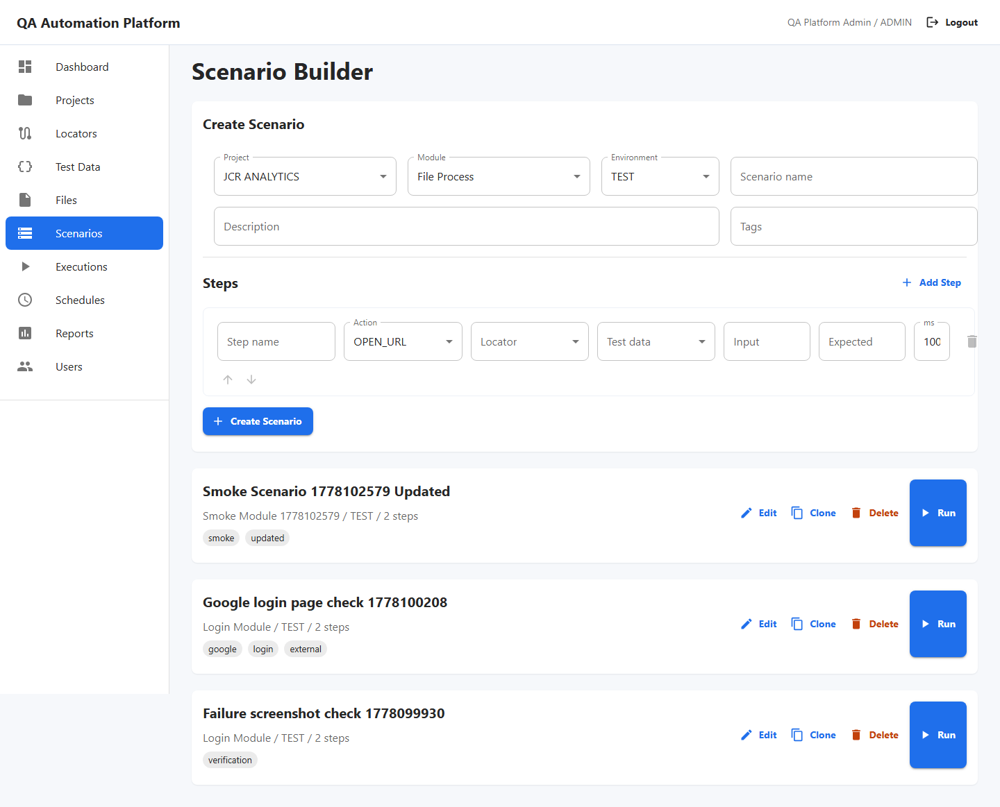
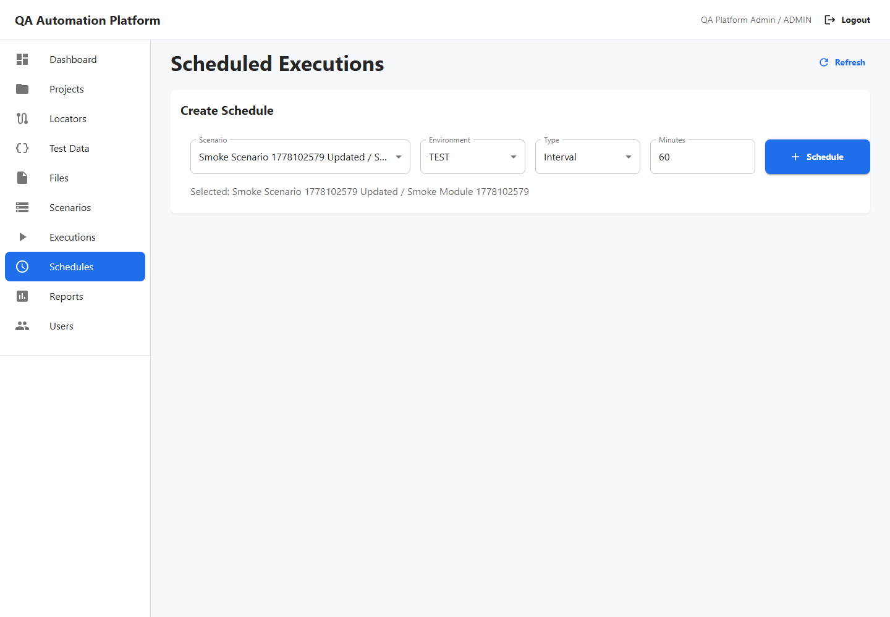

# QA Automation Platform

Internal web platform for managing projects, modules, locators, test data, files, test scenarios and Playwright executions from one shared QA workspace.

## Product Screenshots







More screens are available under `docs/images/`:

- Executions and live logs
- Test data management
- File management
- Reports

## Stack

- Frontend: React, TypeScript, Vite, Material UI
- Backend: NestJS, TypeScript, Prisma
- Database: PostgreSQL
- Automation engine: Playwright runner service
- Auth: JWT with role-based guards
- Local runtime: Docker Compose

## Intranet Docker Start

```bash
cp .env.example .env
# edit .env before first use
docker compose up --build -d
```

Then open:

- Web: http://localhost:5173
- API via web proxy: http://localhost:5173/api

Initial admin is controlled by `.env`:

- `ADMIN_EMAIL`
- `ADMIN_PASSWORD`

From another computer on the same network:

```text
http://<host-computer-ip>:5173
```

Detailed setup: `docs/INTRANET_DEPLOYMENT.md`.

## Private Web Deployment

For VPN/company-network usage with HTTPS reverse proxy:

```powershell
.\scripts\generate-prod-env.ps1
# edit .env.production and add certs/fullchain.pem + certs/privkey.pem
.\scripts\prod-up.ps1
```

Detailed setup: `docs/PRIVATE_WEB_DEPLOYMENT.md`.

## Local Windows Portable Run

If Docker Desktop is not available, this workspace can run with the portable PostgreSQL binary placed under `tools/`:

```powershell
.\scripts\start-local.ps1
```

Stop local processes:

```powershell
.\scripts\stop-local.ps1
```

## Useful Commands

```bash
npm install
npm install --prefix apps/api
npm install --prefix apps/web
npm run dev --prefix apps/api
npm run dev --prefix apps/web
npm run build
```

This repository intentionally does not require committed app-level lockfiles for the internal Docker path; Docker installs each app from its own `package.json`.

For local dev, the Vite dev server proxies `/api` and `/uploads` to `localhost:3000`.

Database commands:

```bash
npm run prisma:generate --prefix apps/api
npm run prisma:migrate --prefix apps/api
npm run prisma:seed --prefix apps/api
```

## Delivered Scope

- System architecture and MVP plan in `docs/`
- Normalized Prisma database schema
- JWT auth and role guards
- User/project/module/locator/test data/scenario/execution APIs
- Encrypted secret test data storage
- File upload/download foundation with scenario step file selection
- React internal QA console
- Playwright execution runner foundation with logs and failure screenshots
- Scheduled scenario runs for recurring automation checks
- Report listing and export endpoints
- Docker Compose local setup
- Private web deployment package for VPN/intranet hosting

## Notes

This is a production-minded starter: it has real separation between UI, API, database and automation runner code. For a company rollout, add SSO/LDAP, Redis-backed queue, object storage, CI/CD and centralized observability as described in `docs/ARCHITECTURE.md` and `docs/ROADMAP.md`.
