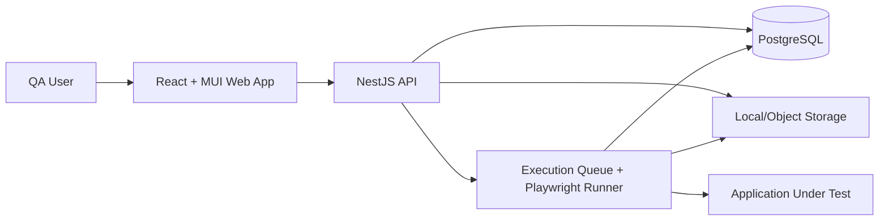
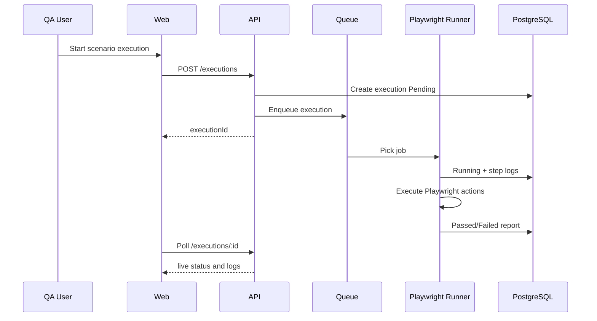
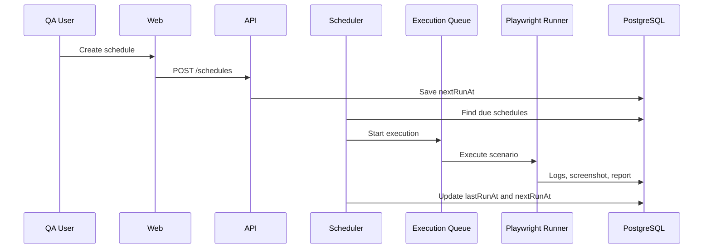

# System Architecture

## High-Level Design

## Core Bounded Contexts

- Identity: login, JWT, roles, user management.
- Workspace: projects and modules.
- Automation assets: locators, locator versions, test data, test files.
- Scenario authoring: scenarios, tags, ordered steps.
- Execution: queueing, status lifecycle, schedules, logs, retries, screenshots.
- Reporting: execution reports, exports and dashboard metrics.
- Governance: audit logs and edit locks.

## Frontend Screens

1. Login
2. Dashboard
3. Users and roles
4. Projects
5. Modules
6. Locators
7. Test data
8. Test files
9. Scenario list
10. Scenario builder
11. Execution center
12. Execution detail and logs
13. Scheduled runs
14. Reports
15. Audit log
16. Settings

## Backend Modules

- `AuthModule`
- `UsersModule`
- `ProjectsModule`
- `ModulesModule`
- `LocatorsModule`
- `TestDataModule`
- `TestFilesModule`
- `ScenariosModule`
- `ExecutionsModule`
- `SchedulesModule`
- `DashboardModule`
- `AuditModule`
- `PrismaModule`

## Execution Flow

## Scheduled Execution Flow

## Best Practices For Production

- Move execution queue to Redis/BullMQ for multi-node scaling.
- Store files and screenshots in S3/MinIO instead of local disk.
- Add LDAP/SSO and short-lived JWT refresh strategy.
- Add optimistic locking for scenario and locator edits.
- Run Playwright workers in isolated containers.
- Add environment-level secrets management through Vault/KMS.
- Capture OpenTelemetry traces and structured logs.
- Enforce audit trails for every write action.
- Add RBAC tests and migration tests in CI.
- Back up PostgreSQL and uploaded assets.
