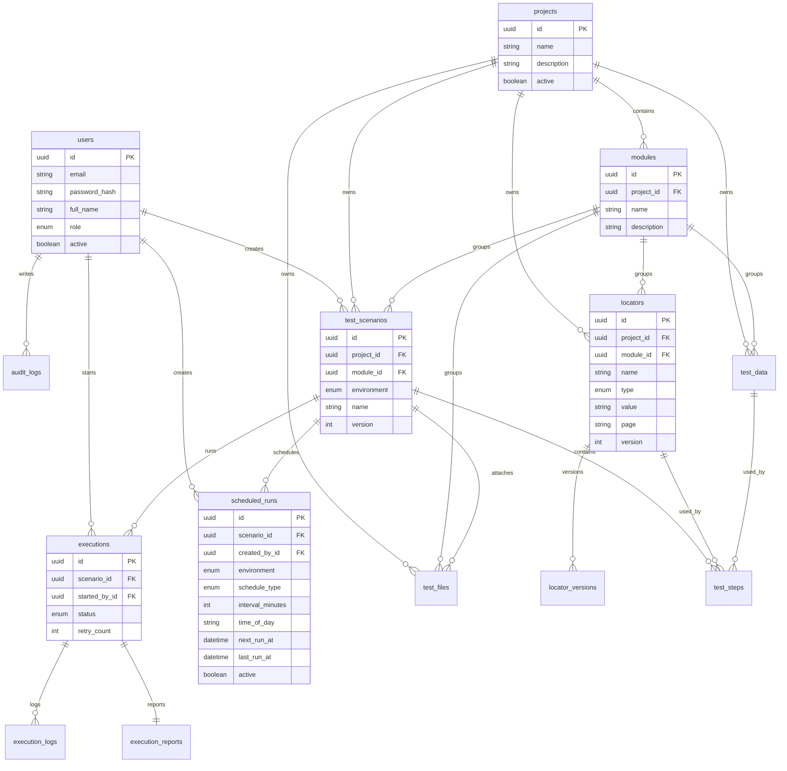

# Database ER Diagram

```mermaid
erDiagram
  users ||--o{ audit_logs : writes
  users ||--o{ test_scenarios : creates
  users ||--o{ executions : starts
  users ||--o{ scheduled_runs : creates
  projects ||--o{ modules : contains
  projects ||--o{ locators : owns
  projects ||--o{ test_data : owns
  projects ||--o{ test_files : owns
  projects ||--o{ test_scenarios : owns
  modules ||--o{ locators : groups
  modules ||--o{ test_data : groups
  modules ||--o{ test_files : groups
  modules ||--o{ test_scenarios : groups
  locators ||--o{ locator_versions : versions
  test_scenarios ||--o{ test_steps : contains
  locators ||--o{ test_steps : used_by
  test_data ||--o{ test_steps : used_by
  test_scenarios ||--o{ executions : runs
  test_scenarios ||--o{ scheduled_runs : schedules
  executions ||--o{ execution_logs : logs
  executions ||--|| execution_reports : reports
  test_scenarios ||--o{ test_files : attaches

  users {
    uuid id PK
    string email
    string password_hash
    string full_name
    enum role
    boolean active
  }

  projects {
    uuid id PK
    string name
    string description
    boolean active
  }

  modules {
    uuid id PK
    uuid project_id FK
    string name
    string description
  }

  locators {
    uuid id PK
    uuid project_id FK
    uuid module_id FK
    string name
    enum type
    string value
    string page
    int version
  }

  test_scenarios {
    uuid id PK
    uuid project_id FK
    uuid module_id FK
    enum environment
    string name
    int version
  }

  executions {
    uuid id PK
    uuid scenario_id FK
    uuid started_by_id FK
    enum status
    int retry_count
  }

  scheduled_runs {
    uuid id PK
    uuid scenario_id FK
    uuid created_by_id FK
    enum environment
    enum schedule_type
    int interval_minutes
    string time_of_day
    datetime next_run_at
    datetime last_run_at
    boolean active
  }
```
